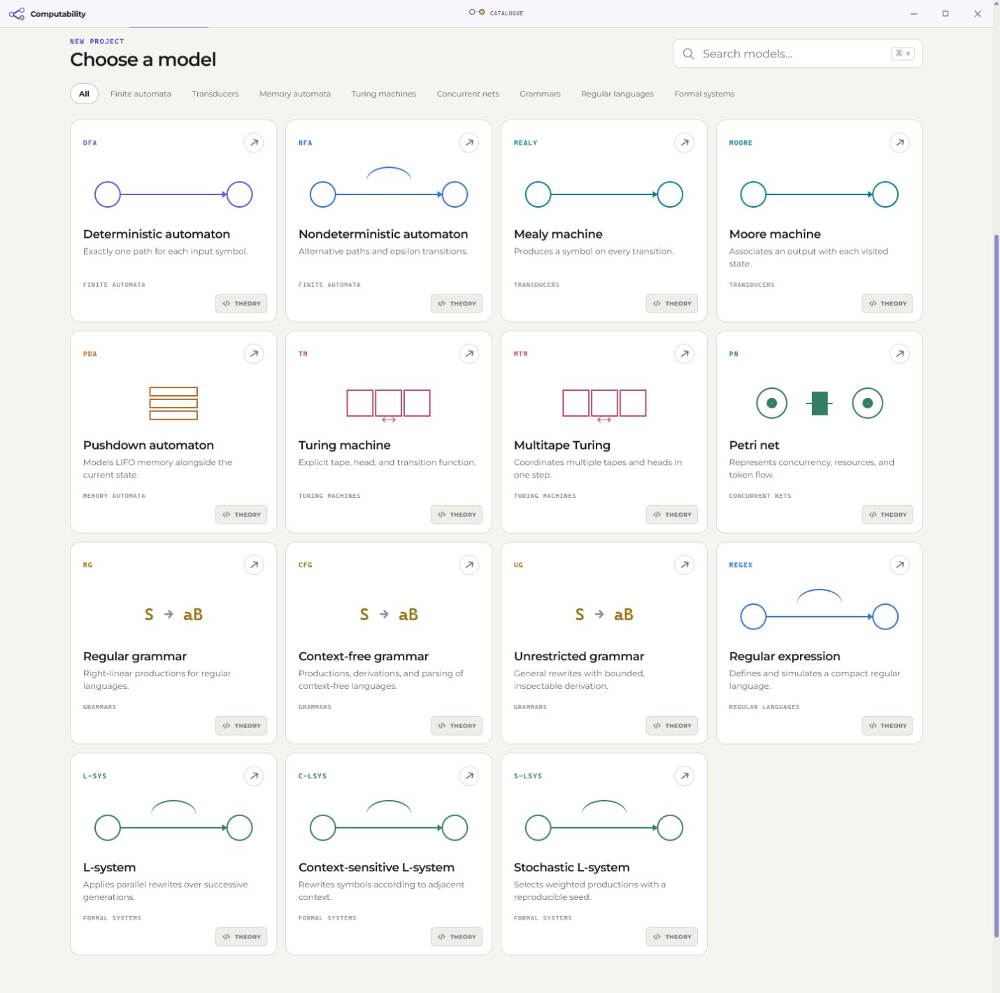
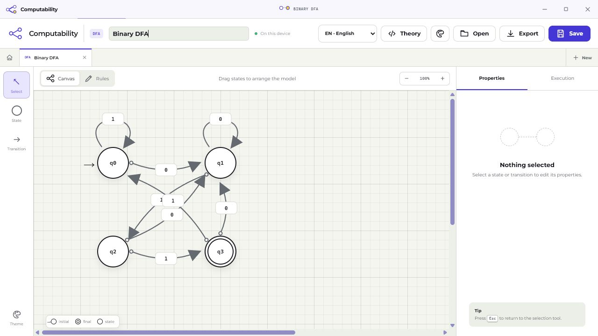
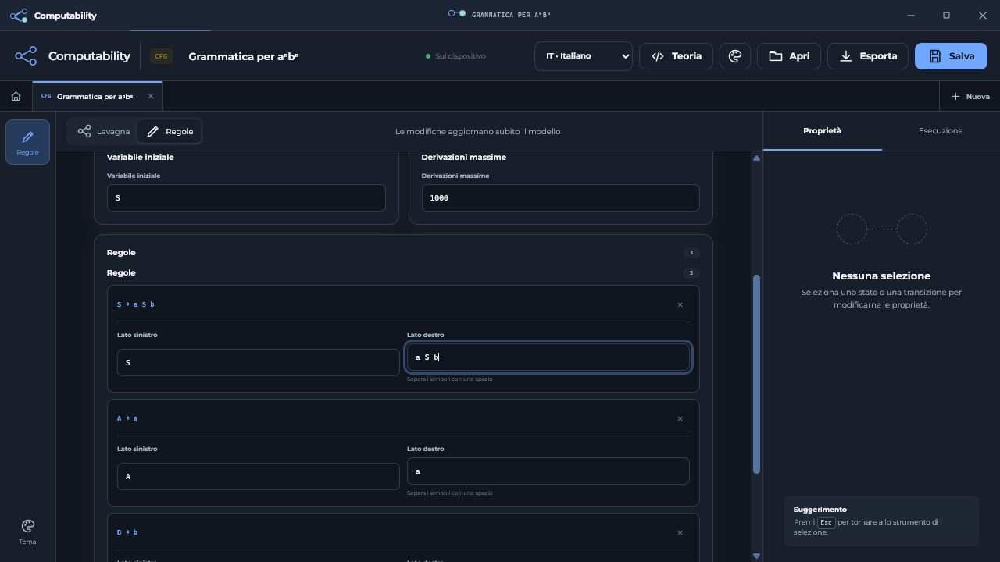

# Computability

Computability is an open-source desktop laboratory for defining, inspecting,
and executing formal models of computation. It combines a Rust simulation core
with a TypeScript and React interface delivered as a Tauri application.

The project is intended for coursework, self-study, and experimentation with
formal languages and computability. Every model is validated before execution;
the interface does not silently change a definition.

## Highlights

- A catalogue of supported computational models with a theory page for each model.
- Visual workspaces for state-based machines and Petri nets.
- Guided rule editors for grammars, L-systems, and regular expressions.
- Multiple open workspaces with local save, reopen, and portable JSON export/import.
- Execution traces, validation errors, and bounded simulation controls.
- A dedicated Algorithms laboratory with formal guidance, ordered derivation
  steps, result export, and direct links back into editable workspaces.
- Transformations including Thompson construction, NFA to DFA, DFA
  minimisation, FA to regular expression, epsilon and unreachable-state
  elimination, regular grammar to NFA, CFG to PDA, and Chomsky normal form.
- Analysis tools for DFA equivalence, CYK, FIRST/FOLLOW and LL(1), plus guided
  pumping-lemma decomposition for regular and context-free languages.
- English, Italian, French, German, Spanish, and Portuguese localization.
- Four built-in themes and an updater backed by signed Tauri release metadata.

## Model catalogue

| Area               | Models                                                                |
| ------------------ | --------------------------------------------------------------------- |
| Finite automata    | DFA; epsilon-NFA                                                      |
| Transducers        | Mealy; Moore                                                          |
| Pushdown automata  | Nondeterministic PDA                                                  |
| Turing machines    | Nondeterministic single-tape TM; deterministic multi-tape TM          |
| Grammars           | Regular; context-free; unrestricted                                   |
| Regular languages  | Regular-expression recognition and Thompson conversion to epsilon-NFA |
| Formal systems     | Deterministic, contextual, and stochastic L-systems                   |
| Concurrent systems | Place/transition Petri nets                                           |

The [feature matrix](docs/feature-matrix.md) is the authoritative capability
ledger. It distinguishes implemented operations from planned teaching tools.
Recognition algorithms with potentially unbounded search use explicit bounds;
the bound is part of the execution definition and is reported in the result.

## Screenshots

The catalogue is the primary entry point for creating a project. It presents
the available model families and links each model to its formal theory.



The workspace supports visual construction of state-based machines, labelled
transitions, semantic state roles, and execution inspection.



Structured models use editors that match their notation. Grammar symbols are
entered as individual removable fields and productions update the model as
they are edited.



## Architecture

```text
React and TypeScript UI
        |
        v
Tauri desktop shell and typed commands
        |
        v
computability-core (Rust)
  - finite automata and transducers
  - pushdown and Turing machines
  - grammars, regular expressions, and L-systems
  - Petri nets
```

The Rust crate owns model validation, simulation, conversions, and serializable
domain types. The frontend owns presentation, editing, localization, and
workspace state. Tauri is the narrow boundary between them, so the algorithms
remain testable without rendering a desktop window. See
[docs/architecture.md](docs/architecture.md) for invariants and command
boundaries.

## Download and install (Windows)

End users only need the published installer. Rust, Node.js, and build tools are
not required.

1. Open the [latest GitHub release](https://github.com/Tony0380/Computability/releases).
2. Download the x64 `.exe` installer (or the MSI package for managed deployment).
3. Run the installer and launch **Computability** from the Start menu.

The installer is per-user. WebView2 is installed or reused by the Tauri
runtime, so a first install may require an internet connection. Release assets
include detached updater signatures and `latest.json`; the updater verifies
these signatures before installing an update.

## Development

### Prerequisites

- Node.js 24 or newer
- Stable Rust toolchain
- The [Tauri v2 system prerequisites](https://v2.tauri.app/start/prerequisites/)

### Run the web interface

```powershell
npm.cmd ci
npm.cmd run dev
```

### Build the desktop application

```powershell
npm.cmd run build:app
```

### Quality checks

```powershell
npm.cmd test
npm.cmd run lint
npm.cmd run format:check
npm.cmd run build
npm.cmd run release:check
```

The `Quality` GitHub Actions workflow runs the same gates on pull requests and
on pushes to `master`. Successful `master` builds receive an immutable tag in
the form `v<version>-master.<run-number>`; the Windows release workflow then
publishes the installer, signatures, and updater manifest.

## Project files

- `src/`: React UI, editors, catalog, theory content, and localization.
- `crates/computability-core/`: Rust models and simulation algorithms.
- `src-tauri/`: Tauri commands, permissions, packaging, and application assets.
- `docs/`: architecture notes, feature matrix, and README screenshots.

## Contributing

Read [CONTRIBUTING.md](CONTRIBUTING.md) before opening a pull request. Changes
should keep the Rust model boundary explicit, add tests for new behavior, and
update the feature matrix or theory content when capabilities change.

## License

Computability is distributed under the [MIT License](LICENSE).

## Links

- [Repository](https://github.com/Tony0380/Computability)
- [Releases](https://github.com/Tony0380/Computability/releases)
- [Architecture](docs/architecture.md)
- [Feature matrix](docs/feature-matrix.md)
- [Contribution guide](CONTRIBUTING.md)
